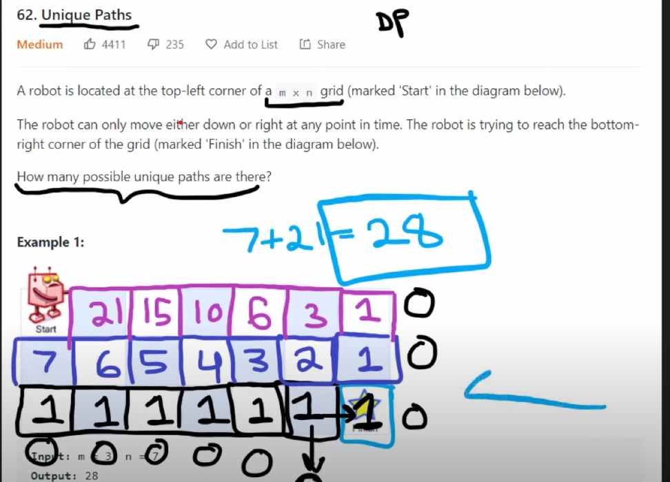

# 874. Walking Robot Simulation
A robot on an infinite XY-plane starts at point (0, 0) facing north. The robot can receive a sequence of these three possible types of commands:

-2: Turn left 90 degrees.
-1: Turn right 90 degrees.
1 <= k <= 9: Move forward k units, one unit at a time.
Some of the grid squares are obstacles. The ith obstacle is at grid point obstacles[i] = (xi, yi). If the robot runs into an obstacle, then it will instead stay in its current location and move on to the next command.

Return the maximum Euclidean distance that the robot ever gets from the origin squared (i.e. if the distance is 5, return 25).

Note:

North means +Y direction.
East means +X direction.
South means -Y direction.
West means -X direction.
There can be obstacle in [0,0].
 
```
Example 1:

Input: commands = [4,-1,3], obstacles = []
Output: 25
Explanation: The robot starts at (0, 0):
1. Move north 4 units to (0, 4).
2. Turn right.
3. Move east 3 units to (3, 4).
The furthest point the robot ever gets from the origin is (3, 4), which squared is 32 + 42 = 25 units away.
```
```
Example 2:

Input: commands = [4,-1,4,-2,4], obstacles = [[2,4]]
Output: 65
Explanation: The robot starts at (0, 0):
1. Move north 4 units to (0, 4).
2. Turn right.
3. Move east 1 unit and get blocked by the obstacle at (2, 4), robot is at (1, 4).
4. Turn left.
5. Move north 4 units to (1, 8).
The furthest point the robot ever gets from the origin is (1, 8), which squared is 12 + 82 = 65 units away.
```
```
Example 3:

Input: commands = [6,-1,-1,6], obstacles = []
Output: 36
Explanation: The robot starts at (0, 0):
1. Move north 6 units to (0, 6).
2. Turn right.
3. Turn right.
4. Move south 6 units to (0, 0).
The furthest point the robot ever gets from the origin is (0, 6), which squared is 62 = 36 units away.
```

# Code Solution
Direction representation    [0,1] +y
Direction representation    [0,-1] -y
Direction representation    [1,0] +x
Direction representation    [-1,0] -x
-2 Left 90 deg
-1 right 90 deg

after each movt calc distance and find max
we stop one stop befor obstacle
Direction order={[0,1],[1,0],[0,-1],[1,0]} cw N,E,S,W MOVT 
keep track d(index)=(d+1)%4; forward;
keep track d(index)=(d-1)%4; backward;


```
class Solution {
    public int robotSim(int[] commands, int[][] obstacles) {
        int x = 0, y = 0; // Initial position
        int[][] directions = {{0, 1}, {1, 0}, {0, -1}, {-1, 0}}; // N, E, S, W
        int d = 0; // Initial direction index (facing North)
        int res = 0;

        // Convert obstacle array to a set of strings for quick lookup
        Set<String> obstacleSet = new HashSet<>();
        for (int[] obstacle : obstacles) {
            obstacleSet.add(obstacle[0] + "," + obstacle[1]);
        }

        // Execute commands
        for (int command : commands) {
            if (command == -1) {
                d = (d + 1) % 4; // Turn right
            } else if (command == -2) {
                d = (d + 3) % 4; // Turn left (same as turning right 3 times)
            } else {
                int dx = directions[d][0];
                int dy = directions[d][1];
                for (int i = 0; i < command; i++) {
                    int nx = x + dx;
                    int ny = y + dy;
                    if (obstacleSet.contains(nx + "," + ny)) {
                        break; // Stop if there's an obstacle
                    }
                    x = nx;
                    y = ny;
                    res = Math.max(res, x * x + y * y);
                }
            }
        }

        return res;
    }
}
```
# There is a robot on an m x n grid. The robot is initially located at the top-left corner (i.e., grid[0][0]). The robot tries to move to the bottom-right corner (i.e., grid[m - 1][n - 1]). The robot can only move either down or right at any point in time.

Given the two integers m and n, return the number of possible unique paths that the robot can take to reach the bottom-right corner.

The test cases are generated so that the answer will be less than or equal to 2 * 109.

 

Example 1:

'''
Input: m = 3, n = 7
Output: 28
'''
'''
Example 2:

Input: m = 3, n = 2
Output: 3
Explanation: From the top-left corner, there are a total of 3 ways to reach the bottom-right corner:
1. Right -> Down -> Down
2. Down -> Down -> Right
3. Down -> Right -> Down
'''

LOGIC DP
compute from bottom row then moce upwards move either right or lefy


```
class Solution {
    public int uniquePaths(int m, int n) {
        int dp[][]=new int[m][n];
        Arrays.stream(dp).forEach(row->Arrays.fill(row,1));
        for(int i=m-2;i>=0;i--){
            for(int j=n-2;j>=0;j--){
                dp[i][j]=dp[i+1][j]+dp[i][j+1];
            }
        }
        return dp[0][0];
        
    }
}
```

# Robot Square With Obstacles
```
class Solution {
    public int uniquePathsWithObstacles(int[][] obstacleGrid) {
        int r=obstacleGrid.length;
        int c=obstacleGrid[0].length;
        return helper(0,0,r,c,obstacleGrid);
        
    }
    static int helper(int i,int j,int r,int c,int[][] A){
        if(i==r || j==c){
            return 0;
        }
        if(A[i][j]==1){
            return 0;
        }
        if(i==r-1 && j==c-1){
            return 1;
        }
        return helper(i+1,j,r,c,A)+helper(i,j+1,r,c,A);

    }
}
```

using DP
```
class Solution {
    public int uniquePathsWithObstacles(int[][] obstacleGrid) {
        int r = obstacleGrid.length;
        int c = obstacleGrid[0].length;
        
        // Memoization table to store the number of paths from each cell
        int[][] memo = new int[r][c];
        
        // Initialize memo table with -1 to indicate unvisited cells
        for (int i = 0; i < r; i++) {
            for (int j = 0; j < c; j++) {
                memo[i][j] = -1;
            }
        }

        // Call the helper function with memoization
        return helper(0, 0, r, c, obstacleGrid, memo);
    }

    static int helper(int i, int j, int r, int c, int[][] A, int[][] memo) {
        // Out of bounds check
        if (i >= r || j >= c) {
            return 0;
        }
        
        // If the cell has an obstacle, return 0
        if (A[i][j] == 1) {
            return 0;
        }
        
        // If we have reached the bottom-right corner, return 1
        if (i == r - 1 && j == c - 1) {
            return 1;
        }
        
        // If the result has already been computed, return it
        if (memo[i][j] != -1) {
            return memo[i][j];
        }

        // Compute the number of unique paths from the current cell by moving down or right
        memo[i][j] = helper(i + 1, j, r, c, A, memo) + helper(i, j + 1, r, c, A, memo);

        // Return the computed result for the current cell
        return memo[i][j];
    }
}

```
