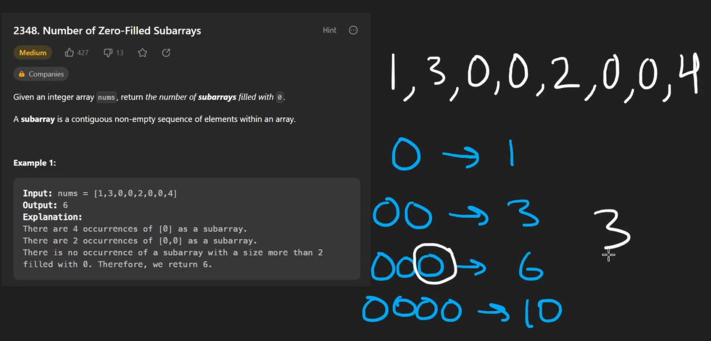
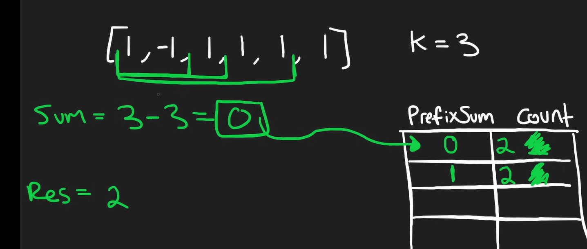

# Taking Inputs:
string s ="";
String [] enttry=s.split(";");\
int n=Integer.parseInt(s[0]);
float f=float.parseFloat(s[0]);

# 1. Minmum,Maximum ,No of Ways
it is Dynamic Programing

You have planned some train traveling one year in advance. The days of the year in which you will travel are given as an integer array days. Each day is an integer from 1 to 365.

Train tickets are sold in three different ways:

a 1-day pass is sold for costs[0] dollars,
a 7-day pass is sold for costs[1] dollars, and
a 30-day pass is sold for costs[2] dollars.
The passes allow that many days of consecutive travel.

For example, if we get a 7-day pass on day 2, then we can travel for 7 days: 2, 3, 4, 5, 6, 7, and 8.
Return the minimum number of dollars you need to travel every day in the given list of days.

 
```
Example 1:

Input: days = [1,4,6,7,8,20], costs = [2,7,15]
Output: 11
Explanation: For example, here is one way to buy passes that lets you travel your travel plan:
On day 1, you bought a 1-day pass for costs[0] = $2, which covered day 1.
On day 3, you bought a 7-day pass for costs[1] = $7, which covered days 3, 4, ..., 9.
On day 20, you bought a 1-day pass for costs[0] = $2, which covered day 20.
In total, you spent $11 and covered all the days of your travel.
```
```
Example 2:

Input: days = [1,2,3,4,5,6,7,8,9,10,30,31], costs = [2,7,15]
Output: 17
Explanation: For example, here is one way to buy passes that lets you travel your travel plan:
On day 1, you bought a 30-day pass for costs[2] = $15 which covered days 1, 2, ..., 30.
On day 31, you bought a 1-day pass for costs[0] = $2 which covered day 31.
In total, you spent $17 and covered all the days of your travel.
```

CODE:
Code Explanation:
Method Signature:

The method mincostTickets takes two input parameters:
days[]: an array of integers representing the days of the year on which the person plans to travel.
costs[]: an array of integers representing the cost of three different passes (1-day, 7-day, and 30-day).
Variable Initialization:

lastDay: Stores the last day of travel, i.e., the last element in the days array.
dp[]: An array to store the minimum travel cost for each day up to lastDay. The size of dp[] is lastDay + 1 to accommodate all possible days from 0 to lastDay.
dp[i] will represent the minimum cost to cover travel up to day i.
Base case: dp[0] = 0, meaning no cost is incurred when there are no travel days.
Main Logic:

The code loops through all days from 1 to lastDay. For each day i, it checks if it's a travel day (i.e., a day present in the days[] array).
Non-Travel Day:

If the current day i is not in days[] (determined by the contains method), the minimum cost on that day will be the same as the previous day (dp[i-1]), because there’s no need to purchase any pass.
Travel Day:

If the current day i is a travel day, the minimum cost is calculated by considering the three possible options:
1-day pass: The cost of using a 1-day pass on day i is dp[i-1] + costs[0].
7-day pass: The cost of using a 7-day pass starting on day i is dp[i-7] + costs[1]. If i is less than 7, it means this 7-day pass covers all previous days, so just use costs[1].
30-day pass: Similarly, the cost of using a 30-day pass is dp[i-30] + costs[2], and if i is less than 30, the pass covers all previous days, so just use costs[2].
The minimum of these three values is chosen and stored in dp[i], ensuring that the cheapest option is always used.
Return Value:

After processing all days, the final cost for the last travel day (lastDay) is stored in dp[lastDay], which is returned as the result.

```
class Solution {
    public int mincostTickets(int[] days, int[] costs) {
        int lastDay = days[days.length-1];
        int[] dp = new int[lastDay+1];
        // Base case: no travel
        dp[0] = 0;
        
        // Iterate over each day
        for (int i = 1; i <= lastDay; i++) {
            // If day i is not a travel day, then cost is same as day before
            if (!contains(days, i)) {
                dp[i] = dp[i-1];
            }
            // Otherwise, we need to find the minimum cost of the three options
            else {
                // Option 1: 1-day pass
                int cost1 = dp[i-1] + costs[0];
                // Option 2: 7-day pass
                int cost2 = (i >= 7) ? dp[i-7] + costs[1] : costs[1];
                // Option 3: 30-day pass
                int cost3 = (i >= 30) ? dp[i-30] + costs[2] : costs[2];
                // Take the minimum cost of the three options
                dp[i] = Math.min(cost1, Math.min(cost2, cost3));
            }
        }
        // Return the cost for the last day
        return dp[lastDay];
    }
    
    // Helper method to check if an array contains a given value
    private boolean contains(int[] arr, int val) {
        for (int i = 0; i < arr.length; i++) {
            if (arr[i] == val) {
                return true;
            }
        }
        return false;
    }
}
```

# 2. For checking based on count 2 methods
 - 1 Using HashMap 
 - 2 Using ArrayTo count Occurence

 # While printing in for loop instead of using break can use return

 # Given a sequence of numbers in an array A. The task is to break short the array such the twice minimum value in the array should be greater than the maximum value in the array. The number of values removed from the array should be minimal. The removal of elements from the array can be done from the start or from the end of the array as per the condition mentioned above.


Sample test cases :
Input 1 :
7
2 
4 
5 
6 
8 
9 
1
Output 1 :
3
Input 2 :
4
4
7
5
6
Output 2 :
0

logic sliding window 
first find valid subarray 
remove its length from rest to find required result

```
public static int minRemovals(int[] arr, int n) {
    int left = 0;
    int minRemovals = n;  // Initially, assume we need to remove all elements

    // Traverse the array with the right pointer
    for (int right = 0; right < n; right++) {
        // For each `right`, move `left` to shrink the window if the condition is violated
        while (left <= right && 2 * findMin(arr, left, right) <= findMax(arr, left, right)) {
            left++;
        }
        // Calculate the current valid subarray length
        int validLength = right - left + 1;
        // Update the minimum removals needed
        minRemovals = Math.min(minRemovals, n - validLength);
    }

    return minRemovals;
}

```
 # 3. Container with max water
 Concept 
 2 pointer approach one for left and another for right
 increment if height{l}< height(r)
 claculate inital 
 ```
 class Solution {
    public int maxArea(int[] heights) {
        int l=0;
        int r=heights.length-1;
        int max=Integer.MIN_VALUE;
        while(l<r){
            int area=Math.min(heights[l],heights[r]) *(r-l);
            max=Math.max(area,max);
            if(heights[l]<heights[r]){
                l++;
            }
            else if(heights[l]>heights[r]){
                r--;;
            }else{
                r--;
            }

        }
        return max;
        
    }
}

 ```

 # Minimum merger opeartions to palindrome
 2 pointer
 if not same increment value of left or right based on value

 Main thing in this 2 ptr is to check weteher to merge from left or right based on which is greater.

 ```
 import java.util.Scanner;

public class Solution {
    public static void main(String[] args) {
        Scanner sc = new Scanner(System.in);
        int n = sc.nextInt(); // Size of the array
        
        if (n <= 0) {
            System.out.println(0);
            return;
        }
        
        int[] arr = new int[n];
        for (int i = 0; i < n; i++) {
            arr[i] = sc.nextInt();
        }
        
        int result = minMergeOperations(arr);
        System.out.println(result);
    }
    
    private static int minMergeOperations(int[] arr) {
        int left = 0;
        int right = arr.length - 1;
        int mergeCount = 0;
        
        while (left < right) {
            if (arr[left] == arr[right]) {
                left++;
                right--;
            } else if (arr[left] < arr[right]) {
                left++;
                arr[left] += arr[left - 1];
                mergeCount++;
            } else {
                right--;
                arr[right] += arr[right + 1];
                mergeCount++;
            }
        }
        
        return mergeCount;
    }
}
```

# Time for Maximum Arrival of Guest
```
import java.util.*;

public class MaxGuestsAtEvent {
    public static void main(String[] args) {
        int[] arrival = { 1, 2, 4, 7, 8, 12 };
        int[] departure = { 2, 7, 8, 12, 10, 15 };

        findMaxGuests(arrival, departure);
    }

    public static void findMaxGuests(int[] arrival, int[] departure) {
        int n = arrival.length;

        // Sort both arrival and departure arrays
        Arrays.sort(arrival);
        Arrays.sort(departure);

        // Initialize variables to keep track of the maximum number of guests
        int maxGuests = 0;
        int currentGuests = 0;
        int maxTime = 0;

        int i = 0, j = 0;

        // Iterate through both arrival and departure arrays
        while (i < n && j < n) {
            // If next event is an arrival, increment guests
            if (arrival[i] <= departure[j]) {
                currentGuests++; // A guest arrives
                if (currentGuests > maxGuests) {
                    maxGuests = currentGuests;
                    maxTime = arrival[i]; // Record the time when max guests were present
                }
                i++; // Move to the next arrival
            } else {
                // If next event is a departure, decrement guests
                currentGuests--; // A guest departs
                j++; // Move to the next departure
            }
        }

        // Output the result
        System.out.println("Maximum number of guests is " + maxGuests + ", present at time " + maxTime);
    }
}

```

 # sliding window
 Main concept dont recalculate for all ,first calculate for window sizee
 then add and subtract
 ```
 import java.util.Scanner;

public class Solution {
    public static void main(String[] args) {
        Scanner sc = new Scanner(System.in);
        
        // Reading input for number of days (N) and consecutive days (K)
        int N = sc.nextInt();
        int K = sc.nextInt();
        
        int[] sales = new int[N];
        // Reading the sales revenue for each day
        for (int i = 0; i < N; i++) {
            sales[i] = sc.nextInt();
        }
        
        // Finding the maximum revenue for any continuous period of K days
        int maxRevenue = findMaxRevenue(sales, N, K);
        
        // Output the maximum revenue
        System.out.println(maxRevenue);
    }
    
    private static int findMaxRevenue(int[] sales, int N, int K) {
        // Calculate the sum for the first window of K days
        int currentSum = 0;
        for (int i = 0; i < K; i++) {
            currentSum += sales[i];
        }
        
        int maxSum = currentSum;  // Initialize maxSum to the first window sum
        
        // Slide the window across the sales array
        for (int i = K; i < N; i++) {
            // Move the window: subtract the first element of the previous window and add the next element
            currentSum = currentSum - sales[i - K] + sales[i];
            // Update maxSum if the current window sum is greater
            maxSum = Math.max(maxSum, currentSum);
        }
        
        return maxSum;
    }
}

 ```

 # Rotating array
 
 logic 1 to rotate in right side
 reverse whole array
 reverse left till k-1
 revers right k till n;

 for rotate acw
  reverse left till k-1
 revers right k till n;
  reverse whole array

  # TCS DAY 2

  Given an array of positive integer nums and a positive integer target, return the minimal length of a subarray whose sum is greater than or equal to the target. If there is no such subarray, return 0 instead.

Example 1
Input: 
7
6
2 3 1 2 4 3
Output: 
2

```
public class Solution {
    public int minSubArrayLen(int target, int[] nums) {
        int n = nums.length;
        int minLength = Integer.MAX_VALUE;
        int left = 0, currentSum = 0;

        for (int right = 0; right < n; right++) {
            currentSum += nums[right];

            // Shrink the window from the left if the sum is greater than or equal to the target
            while (currentSum >= target) {
                minLength = Math.min(minLength, right - left + 1);
                currentSum -= nums[left];
                left++;
            }
        }

        // If no valid subarray found, return 0
        return minLength == Integer.MAX_VALUE ? 0 : minLength;
    }
}

```

# Given an integer array nums, return the number of subarrays filled with 0.
A subarray is a contiguous non-empty sequence of elements within an array
Example 1
Input: 
8
1 3 0 0 2 0 0 4
Output:
6

Explanation:
There are 4 occurrences of [0] as a subarray.
There are 2 occurrences of [0,0] as a subarray.
There is no occurrence of a subarray with a size more than 2 filled with 0. Therefore, we return 6.



Logic 2 variable one for count and another for result
kee counting contn and add to res if not zero reset and continue

ex:
1200
count=1
res=1
count=2
res=1+2
if continuous broken set count=0
```
class Solution {
    public long zeroFilledSubarray(int[] nums) {
        long res=0,count=0;
        for(int n:nums){
            if(n==0){
                count++;
                res+=count;
            }else{
                count=0;
            }

        }
        return res;
        
    }
}
```


# Find the Duplicate Number

## Problem Statement
Given an array of integers `nums` containing `n + 1` integers where each integer is in the range `[1, n]` inclusive, there is only one repeated number in `nums`. Your task is to return this repeated number.

### Constraints
- You must solve the problem without modifying the array `nums`.
- Use only constant extra space.

## Examples

### Example 1
**Input:**  
`nums = [1, 3, 4, 2, 2]`  
**Output:**  
`2`

### Example 2
**Input:**  
`nums = [3, 1, 3, 4, 2]`  
**Output:**  
`3`

Logic
Follow the below steps to solve the problem:

Calculate the sum of array elements and the sum of first (N-1) natural numbers
Return (array sum) – ((N-1) natural numbers sum)

```
  static int findRepeating(int[] arr, int N)
    {
        // Find array sum and subtract sum
        // first n-1 natural numbers from it
        // to find the result.
 
        int sum = 0;
        for (int i = 0; i < N; i++)
            sum += arr[i];
        return sum - (((N - 1) * N) / 2);
    }
```

# minimum Sub array Sum equal to Target
Given an array of positive integer nums and a positive integer target, return the minimal length of a subarray whose sum is greater than or equal to the target. If there is no such subarray, return 0 instead.

```
class Solution {
    public int minSubArrayLen(int target, int[] nums) {
        int l=0;
        int sum=0;
        int min=Integer.MAX_VALUE;
        int n=nums.length;
        for(int r=0;r<n;r++){
            sum+=nums[r];
            while(sum>=target){
            min=Math.min(min,r-l+1);
                sum-=nums[l];
                l++;
            }
        }
        if(min==Integer.MAX_VALUE){
            min=0;
        }
        return min;
    }
}
```
# Index of first occurence subarray sum equal to target
logic keep adding and move to right till sum less
if sum greater keep decrement left till sum equal then check 

```
import java.util.*;
public class Main
{
	public static void main(String[] args) {
		Scanner sc=new Scanner(System.in);
		int n=sc.nextInt();
		int arr[]=new int[n];
		for(int i=0;i<n;i++){
		    arr[i]=sc.nextInt();
		}
		int k=sc.nextInt();
		int cursum=0;
		int l=0;
		boolean flag=false;
		for(int r=0;r<n;r++){
		    cursum+=arr[r];
		    while(cursum>k && l<r){
		        cursum-=arr[l];
		        l++;
		    }
		    if(cursum==k){
		        flag=true;
		        System.out.println(l+" "+(r));
		    }
		}
		if(flag==false){
		    System.out.println("Not Found");
		}
	
	}
}

```


#  total Subarray Sum Equals K
Given an array of integers nums and an integer k, return the total number of subarrays whose sum equals to k.

A subarray is a contiguous non-empty sequence of elements within an array.


Example 1:

Input: nums = [1,1,1], k = 2
Output: 2
Example 2:

Input: nums = [1,2,3], k = 3
Output: 2

hashMap with count 0:1 suppose if whole array sum k;
keep adding current value;



logic similar to sum we check the curr sum and diff if exist in HashMap add add that count to result 
and add current count value to HM

```
class Solution {
    public int subarraySum(int[] nums, int k) {
        HashMap<Integer,Integer> hm=new HashMap<>();
        hm.put(0,1);
        int curr=0;
        int res=0;
        for(int n:nums){
            curr+=n;
            int dif=curr-k;
            res+=hm.getOrDefault(dif,0);
            hm.put(curr,hm.getOrDefault(curr,0)+1);

        }
        return res;

        
    }
}
```

# Subarray Sums Divisible by K
Solved
Medium
Topics
Companies
Given an integer array nums and an integer k, return the number of non-empty subarrays that have a sum divisible by k.

A subarray is a contiguous part of an array.

 

Example 1:

Input: nums = [4,5,0,-2,-3,1], k = 5
Output: 7
Explanation: There are 7 subarrays with a sum divisible by k = 5:
[4, 5, 0, -2, -3, 1], [5], [5, 0], [5, 0, -2, -3], [0], [0, -2, -3], [-2, -3]
Example 2:

Input: nums = [5], k = 9
Output: 0
    

```
import java.util.HashMap;

class Solution {
    public int subarraysDivByK(int[] nums, int k) {
        int res = 0;
        int currSum = 0;
        int[] prefixSum = new int[k]; // Store frequency of remainders
        prefixSum[0] = 1; // There's one way to get a sum divisible by `k` (empty subarray)

        for (int n1 : nums) {
            currSum += n1;
            int rem = currSum % k;

            // Handle negative remainders to ensure they're positive
            if (rem < 0) {
                rem += k;
            }

            // Add the count of subarrays that had the same remainder
            res += prefixSum[rem];

            // Increment the count of this remainder
            prefixSum[rem]++;
        }

        return res;
    }
}

```

# Maximum Sub Array
Example 1:


Input: n=9

nums = [-2,1,-3,4,-1,2,1,-5,4]

Output: 6

Explanation: The subarray [4,-1,2,1] has the largest sum 6.

Logic sliding window approach if currSum lessthan zero then set to 0;
```
import java.util.*;
public class Main
{
	public static void main(String[] args) {
		Scanner sc=new Scanner(System.in);
		int n=sc.nextInt();
		int arr[]=new int[n];
		for(int i=0;i<n;i++){
		    arr[i]=sc.nextInt();
		}
		int max=Integer.MIN_VALUE;
		int cursum=0;
		for(int r=0;r<n;r++){
		    cursum+=arr[r];
		    if(cursum<0){
		        cursum=0;
		    }
		    max=Math.max(max,cursum);
		}
		System.out.println(max);
	
	}
}

```

# 3 sum
```
import java.util.*;

public class Main {
    public static void main(String[] args) {
        Scanner sc = new Scanner(System.in);
        int n = sc.nextInt(); // Size of the array
        int arr[] = new int[n];
        
        // Input array
        for (int i = 0; i < n; i++) {
            arr[i] = sc.nextInt();
        }

        int target = sc.nextInt(); // Target sum
        boolean flag = false;

        // Find triplet
        for (int i = 0; i < n - 2; i++) {
            Set<Integer> hs = new HashSet<>(); // Reset the HashSet for every i
            int t1 = target - arr[i];

            for (int j = i + 1; j < n; j++) {
                int dif = t1 - arr[j];

                if (hs.contains(dif)) {
                    System.out.println(arr[i] + " " + dif + " " + arr[j]);
                    flag = true;
                    return; // Terminate after finding the first triplet
                }
                
                hs.add(arr[j]);
            }
        }

        if (!flag) {
            System.out.println("No triplet found with the given sum");
        }

        sc.close();
    }
}

```
also solvable using 2 ptr approach after sorting
